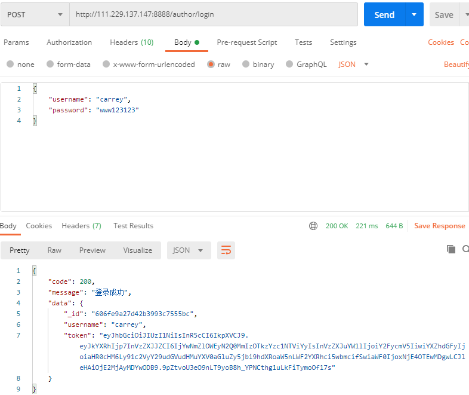
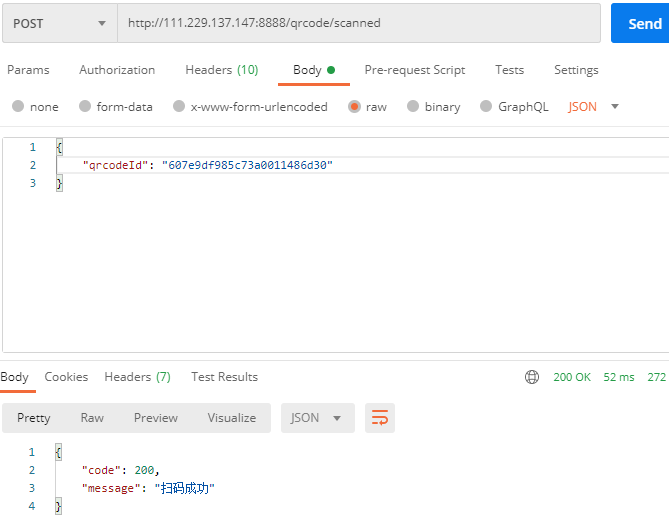
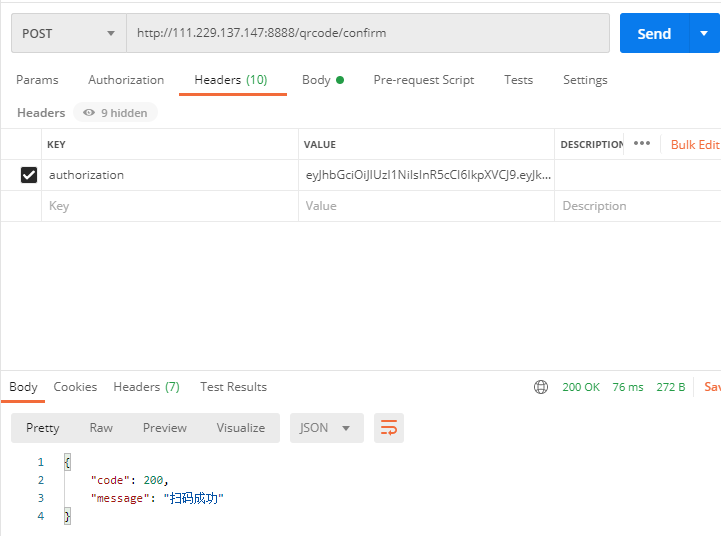
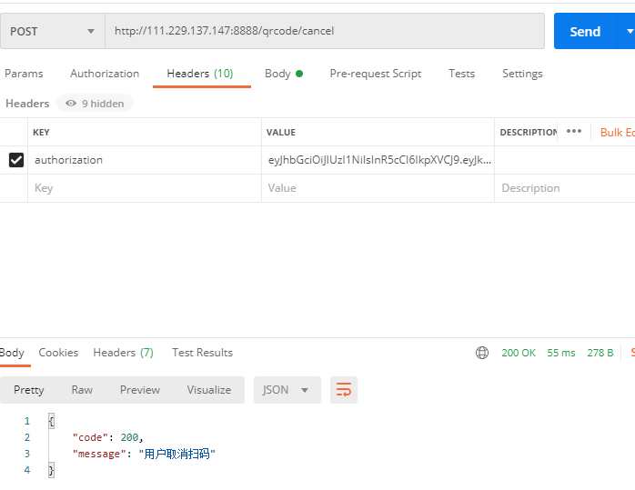

### [预览](http://124.223.11.20/)
### 申明：本文章是对扫码登录的docker实践，文档简要的从扫码登录的实现方式、简单的容器化部署，话不多说，马上开始。
### 所用技术栈：前端（js）、后端（node）、数据库（mongodb）、容器化（docker）
### 一、扫码实现，主要借鉴[知乎](https://zhuanlan.zhihu.com/p/100026915)
扫码登录流程大致如下：
1. 打开登录页面，展示一个二维码，同时轮询二维码状态(web)
2. 打开APP扫描该二维码后，APP显示确认、取消按钮(app)
3. 登录页面展示被扫描的用户头像等信息(web)
4. 用户在APP上点击确认登录(app)
5. 登录页面从轮询二维码状态得知用户已确认登录，并获取到登录凭证(web)
6. 页面登录成功，并进入主应用程序页面(web)
#### 1、打开登录页面，展示一个二维码，同时轮询二维码状态(web)

用户打开登录页选择扫码登录，这时候页面会展示一个二维码，并且会一直轮训二维码的信息。此二维码本质是一个有时限的文本信息，下面是其对应mongodb中的基本Schema：
```js
const QRCodeSchema = new Schema({
  _allreadyUsed: {
    type: Boolean,
    default: false
  },
  url: String,
  // 是否已经被扫码
  scanned: {
    type: Boolean,
    default: false
  },
  status: {
    type: Number,
    // 0 - 未确认；1 - 确认授权；-1 - 取消授权
    default: 0
  },
  createdAt: {
    type: Date,
    default: Date.now
  },
  expireAt: {
    type: Date
  }
});
```
其中，我们可以看到这个二维码的一些信息，包括创建时间、状态、地址等。
#### 2、打开APP扫描该二维码
用户打开手机app扫码，扫码之前得确保手机app已登录，我们可以通过postman模拟登录，这边就不多说了，直接演示：

登录是通过jwt方式实现的，这样就可以通过token区别用户状态，当然这不重要。

#### 3、登录页面展示扫描用户的头像等信息(web)
当登录的用户扫完pc端的二维码时，二维码会显示被扫描用户的一些信息。postman模拟如下，用户扫码：，页面显示当前扫码者信息，并展示正在确认：
#### 4、用户在APP上点击确认登录(app)
此时，用户手机会显示是否确认登录的确认页，当然我们还是用postman模拟，手机确认：
#### 5、登录页面从轮询二维码状态得知用户已确认登录，并获取到登录凭证(web)
pc端得到登录凭证，然后就可以做接下来的事，我这边就页面显示扫码成功一下：，当然，如果用户取消登录，postman模拟：，页面则会显示用户取消提示：

当了解的大体的流程，代码实现就变得尤为简单，代码实现这边不多做介绍，可以直接看[源码](./server.js)
### 容器化打包发布
#### 1、首先撰写dockfile（非常简单，我也是刚学）
```bash
# 基础镜像
FROM centos

# 声明镜像维护者信息
LABEL carrey 1185778813@qq.com

RUN set -e; \
    mkdir -p /apps

RUN curl --silent --location https://rpm.nodesource.com/setup_14.x | bash -
RUN yum -y install nodejs

# 构建node
COPY  dist/     /apps/
RUN  npm config set registry https://registry.npm.taobao.org
WORKDIR /apps
RUN  npm i

# 指定容器启动时要执行的命令，最后一个生效
CMD  ["npm", "start"]
```
注意：打镜像之前要确保所有的依赖环境都已装好。
#### 2、打包、运行
```bash
# 打包
docker build -t qrcode:1.0.0 .
# 运行
docker run -itd --name node_qrcode13 -v /home/docker-test/dist/config:/apps/config -v /home/docker-test/dist/logs:/apps/logs -p 8888:8888  qrcode:1.0.0
```
补充：想要了解docker的可自行研究。另外、mongodb也是docker方式部署：
```bash
 docker run -itd -p 27016:27017 -v $PWD/db:/data/db --name mongodb_qrcode3 mongo
```